<div align="center">

<!-- ═══════════════════════════════════════════════════════════ -->
<!-- MATRIX HEADER — ANIMATED SVG -->
<!-- ═══════════════════════════════════════════════════════════ -->



<br/>


<br/><br/>

[](https://github.com/BUNNY2205-blip)
&nbsp;
[](https://github.com/BUNNY2205-blip?tab=followers)
&nbsp;
[](https://github.com/BUNNY2205-blip)

</div>

<!-- ═══════════════════════════════════════════════════════════ -->


<div align="center">

```
 ╔══════════════════════════════════════════════════════════════════╗
 ║                                                                  ║
 ║   > SYSTEM.PROFILE                                               ║
 ║   > SUBJECT: Sanchit Sharma                                      ║
 ║   > LOCATION: Jaipur, Rajasthan, India                           ║
 ║   > CONTACT: sanchitsharma0122@gmail.com                         ║
 ║   > STATUS: ACTIVE — Currently deployed at Coplur                ║
 ║                                                                  ║
 ╚══════════════════════════════════════════════════════════════════╝
```

</div>

<br/>

<table align="center" border="0" cellspacing="0" cellpadding="12">
<tr>
<td valign="top" width="50%">

```c
// ═══ ABOUT.exe ═══
```

Backend-focused engineer with **3 internships** across cloud, data pipelines, and API architecture. Currently deployed at **Coplur** — building production REST APIs on Azure, enforcing CI/CD discipline, and cutting latency where others accept it.

> *"I don't write code for appraisals.*
> *I architect systems that run quietly in the dark —*
> *reliably, without applause."*

</td>
<td valign="top" width="50%">

```
┌──────────────────────────────┐
│  > SPECIALIZATION            │
│  ────────────────            │
│    ▸ Backend Systems         │
│    ▸ REST API Design         │
│    ▸ Distributed Architecture│
│    ▸ AI/ML Applications      │
│    ▸ Data Engineering        │
│    ▸ Cloud Infrastructure    │
│                              │
│  > AFFILIATION               │
│  ──────────────              │
│    ▸ Coplur  ·  SDE Intern   │
│    ▸ SKIT    ·  B.Tech DS    │
└──────────────────────────────┘
```

</td>
</tr>
</table>

<!-- ═══════════════════════════════════════════════════════════ -->


<div align="center">

### `> TECH_STACK.load()`
*Weapons in the arsenal — cleared for deployment*

<br/>

**`[ PRIMARY LANGUAGES ]`**


<br/>

**`[ FRAMEWORKS & TOOLS ]`**


<br/>

**`[ CLOUD & INFRASTRUCTURE ]`**


<br/>

**`[ DATA & INTELLIGENCE ]`**


</div>

<!-- ═══════════════════════════════════════════════════════════ -->


<div align="center">

### `> PROJECT_FILES.decrypt()`
*Selected operations — classified details below*

</div>

<br/>

<table align="center" border="0" width="92%" cellpadding="10">

<tr>
<td width="50%" valign="top">

```diff
+ PROJECT: Smart Interview Portal
+ STATUS:  ACTIVE
```
`Python` `Flask` `Gemini API` `JWT` `SQLite`

Full-stack REST API for AI-driven mock interviews and dynamic MCQ generation. JWT-authenticated. ORM-backed. **8+ endpoints** across 5 modules — average API round-trip cut by **40%**.

</td>
<td width="50%" valign="top">

```diff
+ PROJECT: AI Interview Report Generator
+ STATUS:  ACTIVE
```
`Python` `Gemini API` `Flask` `Data Engineering`

Automated structured interview report generation via LLM inference pipelines. Eliminated manual reporting overhead by **70%**. Designed for scale, not prototypes.

</td>
</tr>

<tr>
<td width="50%" valign="top">

```diff
! PROJECT: Sentinel — Password Manager
! STATUS:  ARCHIVED
```
`Python` `Streamlit` `SQLite` `Cryptography`

Zero-plaintext credential vault. AES-256 encryption. Zero regression failures across 100+ entries. Retrieval latency reduced **30%** through indexed queries and in-memory caching.

</td>
<td width="50%" valign="top">

```diff
! PROJECT: ReWear — Fashion Resale Platform
! STATUS:  ARCHIVED
```
`Python` `Flask` `HTML` `CSS` `JavaScript`

Peer-to-peer sustainable fashion marketplace. End-to-end prototype with social features and mobile-first design. Cross-browser compatible.

</td>
</tr>

<tr>
<td width="50%" valign="top">

```diff
! PROJECT: Tic-Tac-Toe AI Engine
! STATUS:  ARCHIVED
```
`Python` `Flask` `HTML` `CSS` `JavaScript`

Unbeatable AI opponent via minimax algorithm. Real-time state via localStorage. Zero server database dependency. **100% win-or-draw** result.

</td>
<td width="50%" valign="top">

```diff
! PROJECT: Data Visualisation Dashboards
! STATUS:  ARCHIVED
```
`Python` `Matplotlib` `Seaborn` `Pandas`

Business-decision dashboards for 3 real-world datasets. Delivered to stakeholder sign-off within first review cycle. Reusable automation scripts for preprocessing pipelines.

</td>
</tr>

</table>

<!-- ═══════════════════════════════════════════════════════════ -->


<div align="center">

### `> STATS.render() // Intelligence Dashboard`

<br/>

<!-- Stats + Top Languages -->
<a href="https://github.com/BUNNY2205-blip">

</a>
&nbsp;
<a href="https://github.com/BUNNY2205-blip">

</a>

<br/><br/>

<!-- Streak -->
<a href="https://github.com/BUNNY2205-blip">

</a>

<br/><br/>

<!-- Contribution Graph -->


<br/><br/>

<!-- Snake -->
<picture>
  <source media="(prefers-color-scheme: dark)" srcset="https://raw.githubusercontent.com/BUNNY2205-blip/BUNNY2205-blip/output/github-contribution-grid-snake-dark.svg" />
  <source media="(prefers-color-scheme: light)" srcset="https://raw.githubusercontent.com/BUNNY2205-blip/BUNNY2205-blip/output/github-contribution-grid-snake.svg" />
  
</picture>

</div>

<!-- ═══════════════════════════════════════════════════════════ -->


<div align="center">

### `> CAREER_LOG.trace()`

</div>

<br/>

<table align="center" border="0" width="88%" cellpadding="8">

<tr>
<td width="28%" valign="top" align="right">

```
Sep 2025 →
Present
```

</td>
<td width="4%" valign="top" align="center">

**▸**

</td>
<td width="68%" valign="top">

**SDE Intern &nbsp;·&nbsp; Coplur** *(Remote)*
Reduced API response time **35%** via caching and logging. Shipped **8+ endpoints** on Azure App Service. Zero post-deploy incidents via GitHub Actions CI/CD. Introduced OOP design review standards.

</td>
</tr>

<tr>
<td valign="top" align="right">

```
Jun → Jul
2025
```

</td>
<td valign="top" align="center">**▸**</td>
<td valign="top">

**Python & Data Analysis Intern &nbsp;·&nbsp; Coplur** *(Jaipur)*
Improved pipeline reliability **45%** for 3 real-world datasets. Delivered stakeholder dashboards using Matplotlib & Seaborn. Developed reusable Python automation for preprocessing workflows.

</td>
</tr>

<tr>
<td valign="top" align="right">

```
May → Jun
2024
```

</td>
<td valign="top" align="center">**▸**</td>
<td valign="top">

**Web Development Intern &nbsp;·&nbsp; KisTechno Software** *(Jaipur)*
**25%** page load improvement via Lighthouse-led asset optimisation. Reduced UI bug backlog **60%** within 3 weeks. Cross-browser compliance across Chrome, Firefox, Safari.

</td>
</tr>

<tr>
<td valign="top" align="right">

```
2023 → 2027
```

</td>
<td valign="top" align="center">**▸**</td>
<td valign="top">

**B.Tech — Data Science &nbsp;·&nbsp; SKIT, Jaipur**
CGPA: 7.9 &nbsp;·&nbsp; Currently active &nbsp;·&nbsp; Swami Keshwanand Institute of Technology

</td>
</tr>

<tr>
<td valign="top" align="right">

```
Ongoing
```

</td>
<td valign="top" align="center">**▸**</td>
<td valign="top">

**Self-Directed Study**
System Design · DSA · LeetCode · HLD/LLD · DBMS Internals · OS Fundamentals

</td>
</tr>

</table>

<!-- ═══════════════════════════════════════════════════════════ -->


<div align="center">

### `> ACHIEVEMENTS.unlock()`

<br/>


<br/>

**`[ CERTIFICATIONS ]`**


&nbsp;


&nbsp;


</div>

<!-- ═══════════════════════════════════════════════════════════ -->


<div align="center">

### `> CONNECT.establish()`

<br/>

[](https://github.com/BUNNY2205-blip)
&nbsp;&nbsp;
[](https://linkedin.com/in/sanchit-sharma)
&nbsp;&nbsp;
[](mailto:sanchitsharma0122@gmail.com)

[](https://leetcode.com/BUNNY2205)
&nbsp;&nbsp;
[](tel:+917357164769)

<br/><br/>

---

<br/>

```
╔════════════════════════════════════════════════════════════╗
║                                                            ║
║   "There is no spoon."                                     ║
║                                                            ║
║    Legacy isn't written by time.                           ║
║    It is compiled by those who refuse mediocrity.          ║
║                                                            ║
╚════════════════════════════════════════════════════════════╝
```

<br/>


</div>
